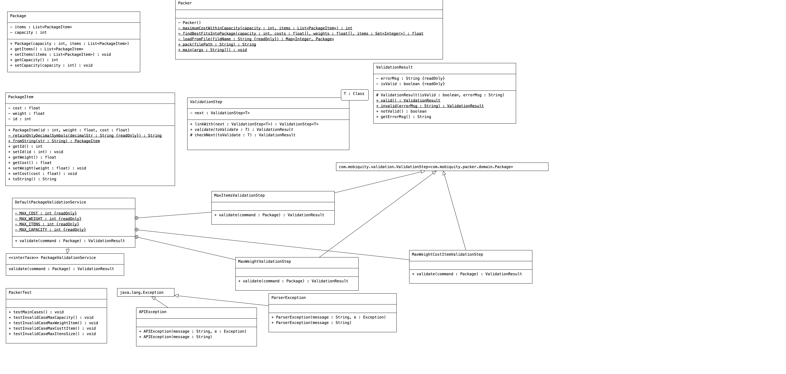

# Packaging Challenge

# Approach to Solve this Problem

I used an algorithm called Knapsack to solve this problem. It was implemented using dynamic-programming, and has the time complexity of O(n*W) - where
n is the quantity of itens, and W is the Package capacity.

## Introduction

You want to send your friend a package with different things.
Each thing you put inside the package has such parameters as index number, weight and cost. The package has a weight limit. 
Your goal is to determine which things to put into the package so that the total weight is less than or equal to the package limit and the total cost is as large as possible.
You would prefer to send a package which weighs less in case there is more than one package with the same price.

# Input sample
Your API should accept as its only argument a path to a filename. The input file contains several lines. Each line is one test case.
Each line contains the weight that the package can take (before the colon) and the list of items you need to choose. Each item is enclosed in parentheses where the 1st number is a item’s index number, the 2nd is its weight and the 3rd is its cost. E.g.
81 : (1,53.38,€45) (2,88.62,€98) (3,78.48,€3) (4,72.30,€76) (5,30.18,€9) (6,46.34,€48)
8 : (1,15.3,€34)
75 : (1,85.31,€29) (2,14.55,€74) (3,3.98,€16) (4,26.24,€55) (5,63.69,€52) (6,76.25,€75) (7,60.02,€74) (8,93.18,€35) (9,89.95,€78)
56 : (1,90.72,€13) (2,33.80,€40) (3,43.15,€10) (4,37.97,€16) (5,46.81,€36) (6,48.77,€79) (7,81.80,€45) (8,19.36,€79) (9,6.76,€64)

# Output sample
For each set of items that you put into a package provide a new row in the output string (items’ index numbers are separated by comma). E.g.
4 
-
2,7 
8,9

## Components Diagram

The Class Diagram is as following:

- `com.mobiquity.packer.Packer`:  this is the main class for our API. We aim that the developer would call the method Packer.pack (passing a File path to the packaging scenarios, and getting a result as a String)
- `com.mobiquity.packer.domain.Package`: it is a class describing the Package. A Package can be seen as a Bag, where you have the Package capacity (maximum amount of weights for all the itens), and a list of itens (called PackageItem)
- `com.mobiquity.packer.domain.PackageItem`: it represents an item inside a Package. A PackageItem has: unique ID, weight and a cost.

## Implementation

How to solve this problem with the best performance? This problem fits pretty well to the Knapsack solution. The decision problem form of the knapsack problem 
(`Can a value of at least V be achieved without exceeding the weight W?`) is NP-complete, so there is no known algorithm that is both correct and fast (polynomial-time) in all cases. 

The main idea here was to approach this problem using the Knapsack, more precisely the 0/1 version of this problem, because we want to know if we can or we cannot fit an Item in the Package.

There are some ways to implement a solution using Knapsack. We can implement a recursive solution, or using a dynamic-programming approach. In our case, not only the dynamic programming is a better fit
(because we want to know which itens were choosen), but it is a better algorithm, mostly known as pseudo-polynomial. It means that it cannot yet be entirely solved in a polynomial time 
(it is a NP-Complete problem), but at least the algorithm runs polynomial on the magnitude of the input, but exponential in the size of the input.

Dynamic programming is a strategy for trying to simplify problems that can be decoupled into sub-problems using some linnearization techniques. Otherwise exponentially-difficult programming problems. 
The idea is to store use an Array (or Matrix) the results of subproblems, so that we do not have to re-compute them later, solving the less complex subproblems first is the key for this solution to work.

To use dynamic programming, we first create a 2-dimensional table with dimensions from 0 to n (where n is the iten's size) and 0 to W (where W is the capacity of a Package). 
Then, we use a bottom-up approach to calculate the optimal solution with this table.

## How to Run It

Having the Maven installed, just type the following:

- `mvn test`

## Known Issues, Design Decisions and Lessons Learned

1. The Knapsack 0/1 usually doesn't work with float (fractional) values, so I had to do some adjustments in the algorithm to handle that. It seems simple, but the weight, for example, is used as an index to the Matrix used in our dynamix programming technique.
2. I decided to inovate a little bit, and applied a design pattern called Chain of Responsibility is a behavioral design pattern that lets you pass requests along a chain of handlers. This is a very good pattern when handling a sequence of Validations, for example;
3. We applied a Test Driven Development (TDD), creating the tests first, and defining the constraints in the tests as much as I could, doing this before moving to the real implementation. All tests are developed using JUnit 5.
4. The only exported API method is the Packer.pack. We surely need to know better, from the developer/customer perspective, or from the product requirements, if we need something else accessible from API vicinity.

# References
1. Knapsack problem description: https://en.wikipedia.org/wiki/Knapsack_problem
2. A Dynamic Solution to Knapsack 0/1: https://www.personal.kent.edu/~rmuhamma/Algorithms/MyAlgorithms/Dynamic/knapsackdyn.htm
3. Lectures Explaining Knapasck 0/1 Dynamic Programming Approach: http://cse.unl.edu/~goddard/Courses/CSCE310J/Lectures/Lecture8-DynamicProgramming.pdf
4. Chain of Responsibility - Design Pattern: https://refactoring.guru/design-patterns/chain-of-responsibility
